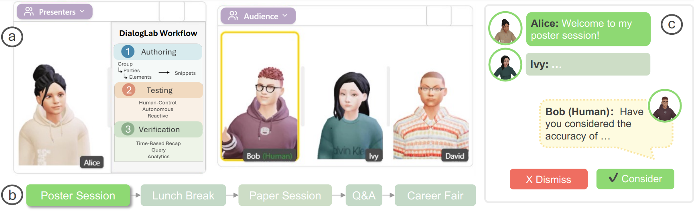

# AI Interview Simulator



An **AI-powered oral interview simulator** built on the [DialogLab](https://dl.acm.org/doi/10.1145/3746059.3747696) multi-agent conversation framework. Users upload flashcard question sets, select a 3D animated interviewer avatar, and practice answering questions aloud — receiving real-time feedback after each response.

Developed as part of the **MLMI10** module.

---

## How It Works

1. **Upload flashcards** — provide a CSV or JSON file of question/answer pairs (or enter them manually)
2. **Choose your interviewer** — select from preset 3D avatars with distinct voices
3. **Start the interview** — the AI examiner asks questions one at a time, listens to your answers (via microphone or text), and gives immediate feedback
4. **Review performance** — at the end, the examiner summarises how you did

---

## Features

- **Flashcard-driven interviews** — load any topic by uploading `.csv` or `.json` Q&A pairs
- **3D animated interviewer** — lip-synced Ready Player Me avatars powered by the TalkingHead library
- **Speech recognition** — answer via microphone using the Web Speech API, with text input as fallback
- **Student webcam** — your video feed is shown alongside the interviewer
- **Real-time assessment** — the examiner compares your answer to the correct answer and gives concise feedback before moving on
- **Performance summary** — final summary of correct/incorrect answers at the end of the session
- **Multiple interviewer presets** — Alice, Grace, Bob, David, and Henry (varied genders and accents)

---

## Interviewer Presets

| Name  | Gender | Accent       |
|-------|--------|--------------|
| Alice | Female | British (en-GB) |
| Grace | Female | British (en-GB) |
| Bob   | Male   | British (en-GB) |
| David | Male   | American (en-US) |
| Henry | Male   | American (en-US) |

---

## Flashcard Format

**CSV** (one question per line):
```csv
question,answer
What is gradient descent?,An optimization algorithm that minimizes a loss function by iteratively moving in the direction of steepest descent
What is overfitting?,When a model learns the training data too well and fails to generalize to new data
```

**JSON**:
```json
[
  { "question": "What is gradient descent?", "answer": "An optimization algorithm..." },
  { "question": "What is overfitting?", "answer": "When a model learns the training data too well..." }
]
```

---

## Prerequisites

- **Node.js** 18+
- **npm** 8+
- At least one LLM API key (OpenAI or Google Gemini)
- Google Cloud Text-to-Speech API key (required for avatar speech)
- A modern browser with WebGL and Web Speech API support (Chrome recommended)

---

## Getting Started

### 1. Install Dependencies

```bash
# Client
cd client
npm install

# Server
cd ../server
npm install
```

### 2. Configure Environment Variables

Create a `.env` file in `server/`:

```env
NODE_ENV=development

# LLM provider — at least one required
GEMINI_API_KEY=your-gemini-api-key
API_KEY_LLM=your-openai-api-key

# Default LLM settings
DEFAULT_LLM_PROVIDER=gemini        # or openai
DEFAULT_OPENAI_MODEL=gpt-4
DEFAULT_GEMINI_MODEL=gemini-2.0-flash

# Text-to-Speech — required for avatar speech
TTS_API_KEY=your-google-tts-api-key
TTS_ENDPOINT=https://eu-texttospeech.googleapis.com/v1beta1/text:synthesize
```

### 3. Start the Server

```bash
cd server
node server.js
# Listening on http://localhost:3010
```

### 4. Start the Client

```bash
cd client
npm run dev
# Open http://localhost:5173
```

### 5. Launch the Interview Simulator

Click **Quiz** in the top navigation bar, or navigate to `http://localhost:5173?mode=quiz`.

---

## Project Structure

```
.
├── client/                          # React/Vite frontend (port 5173)
│   └── src/
│       ├── App.jsx                  # Mode routing (authoring vs. interview)
│       ├── sceneConfig.js           # Interview scene & conversation config builders
│       ├── config.js                # API endpoint definitions
│       └── components/
│           ├── Header.jsx           # Top nav with Quiz mode button
│           └── quiz/
│               ├── SceneWrapper.jsx # Main interview UI (setup + live session)
│               └── FlashcardUploader.jsx  # CSV/JSON flashcard import
│
└── server/                          # Express API server (port 3010)
    ├── server.js                    # API routes, including /api/quiz/prepare
    ├── chat.js                      # Conversation orchestration (DialogLab core)
    ├── agent.js                     # Agent model with role descriptions
    ├── conversationmemory.js        # Context window and summarisation
    ├── tts.js                       # Google Cloud TTS integration
    └── providers/
        ├── llmProvider.js           # OpenAI / Gemini abstraction
        └── geminiAPI.js             # Gemini client
```

---

## Underlying Framework

This project is built on **DialogLab**, a research tool for configuring and orchestrating multi-agent conversations with animated 3D avatars (UIST 2025). The interview simulator uses DialogLab's:

- **ConversationManager** — round-robin turn-taking between examiner and student proxy
- **Agent model** — examiner agent with a `roleDescription` that enforces assessment behaviour
- **Conversation memory** — sliding context window so the examiner tracks what has already been asked
- **TTS + TalkingHead pipeline** — speech synthesis synchronised to avatar lip animation

```bibtex
@inproceedings{dialoglab2025,
  author    = {Hu, Erzhen and Chen, Yanhe and Li, Mingyi and Phadnis, Vrushank and Xu, Pingmei and Qian, Xun and Olwal, Alex and Kim, David and Heo, Seongkook and Du, Ruofei},
  title     = {DialogLab: Configuring and Orchestrating Multi-Agent Conversations},
  booktitle = {Proceedings of the 38th Annual ACM Symposium on User Interface Software and Technology (UIST '25)},
  year      = {2025},
  publisher = {Association for Computing Machinery},
  doi       = {10.1145/3746059.3747696}
}
```

---

## Third-Party Licenses

| Component | License | Notes |
|---|---|---|
| [TalkingHead](https://github.com/met4citizen/TalkingHead) | MIT | Avatar lip-sync animation (`client/public/libs/talkinghead.mjs`) |
| [Three.js](https://threejs.org/) | MIT | 3D rendering |
| [Ready Player Me](https://readyplayer.me/) avatars | Custom | Demo only — not covered by this project's MIT license |

This project is licensed under the **MIT License**. © 2025 Erzhen Hu.